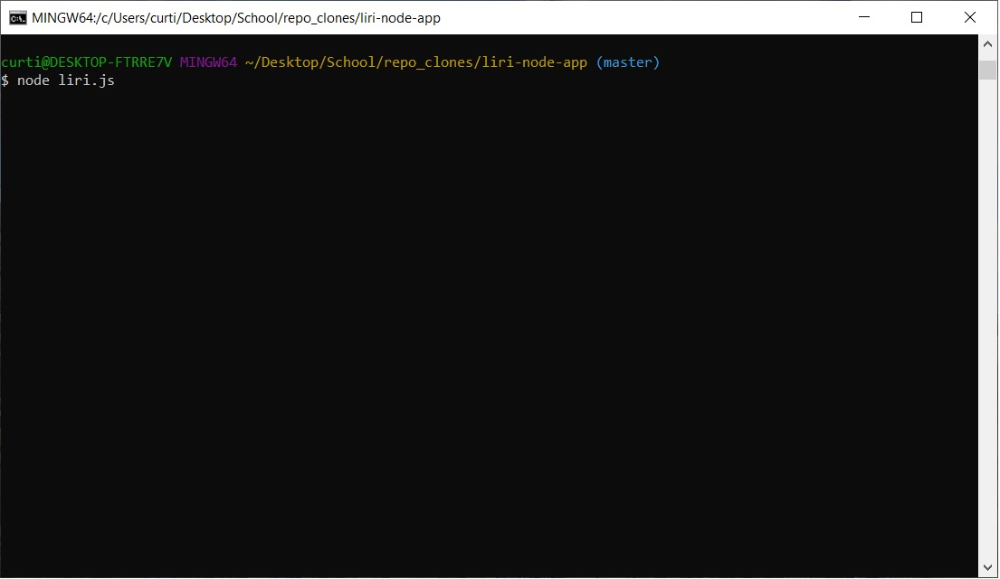
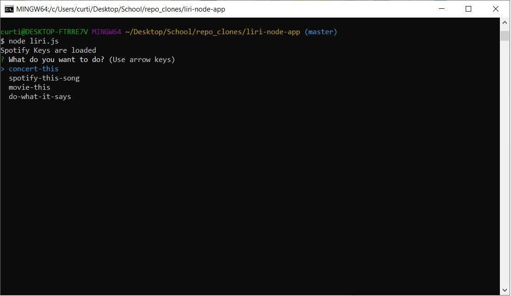
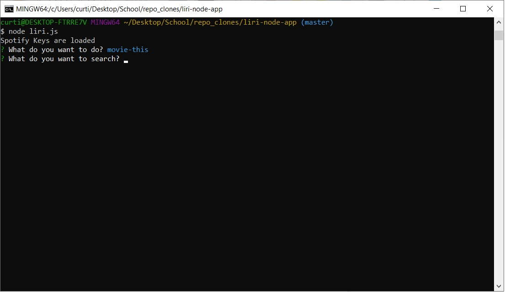
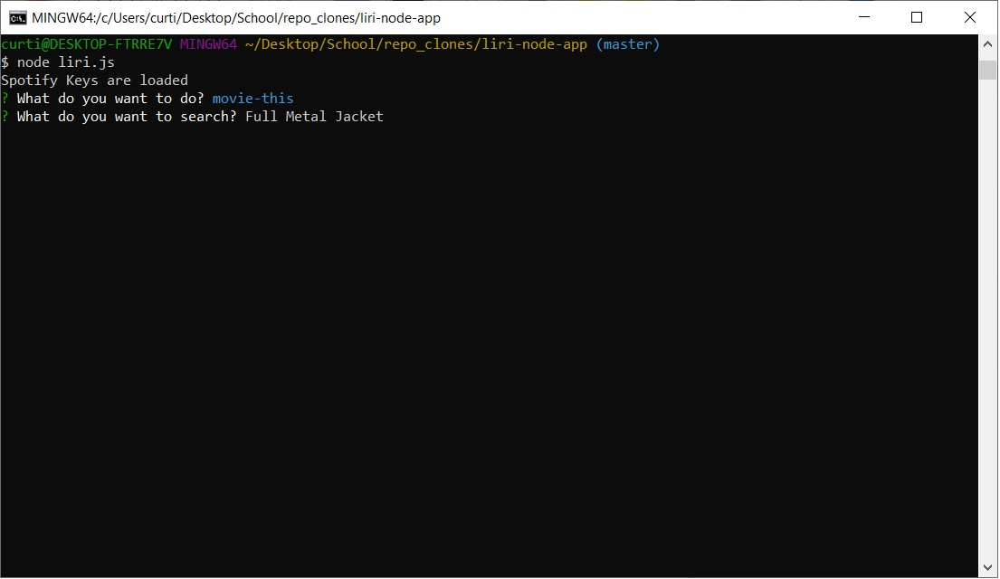
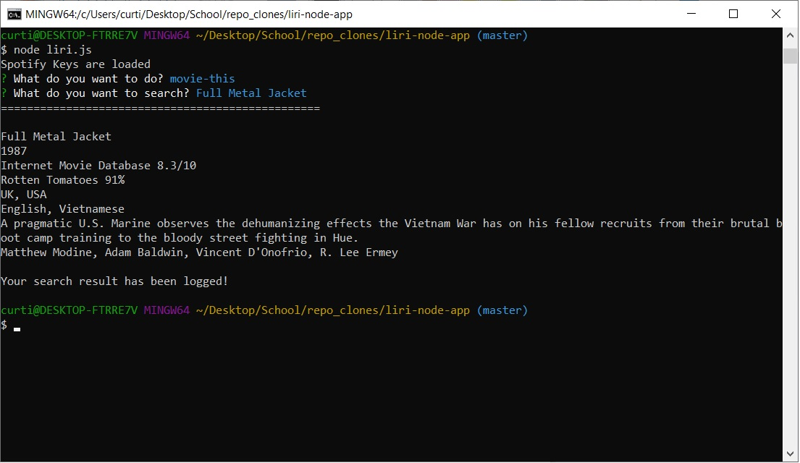

# liri-node-app

This is an application that uses the Spotify API, OMDB API, and Bands in Town API.  You start the application by typing "node liri.js" in your bash terminal.  You will be presented with 4 options to select from using your arrow keys.  Once you select an option you can type whatever you want to search for pertaining to your initial choice.

"concert-this": This will take the entered band and search the Bands in Town API for tour locations, dates and venues of the search.

"spotify-this-song": This will take the entered song and search the Spotify API, it will return the artist name, song name, a preview url from spotify (if available), and the album name.

"movie-this": This will take the entered movie and search the OMDB API, it will return the title, year released, IMDB and Rotten Tomatoes ratings, Country, language, plot, and the actors.

"do-what-it-says": This will read the random.txt file and pass the data through the correct function.  You will still be asked to enter data after selecting "do-what-it-says", this can be left blank.  If you enter data here it will not be passed through any functions.  Note: You can change the data in the random.txt file.  If you make a change you must use the same format, i.e. what you want to do, your search query. (spotify-this-song, I want it that way), (concert-this, Eagles), (movie-this, Full Metal Jacket).

++++++ Important ++++++
******************************************************************************
You must have the modules listed below installed on your PC in the same file location as the cloned files.  Node.js can be installed here: https://nodejs.org/en/.  All other packages can be installed in a bash terminal using npm.  You must run "npm init" in bash BEFORE installing the npm packages.

-node.js
 
-node-spotify-api (you must have your own API key for this API)
 
-moment
 
-axios
 
-inquirer

Once installed, type "node liri.js" in your bash terminal.

******************************************************************************
Watch it work:
 
<video width width="650" height="377" controls>
    <source src="images/Liri-Node-App.m4v" type="video/m4v">
</video>

Walkthrough:
 

